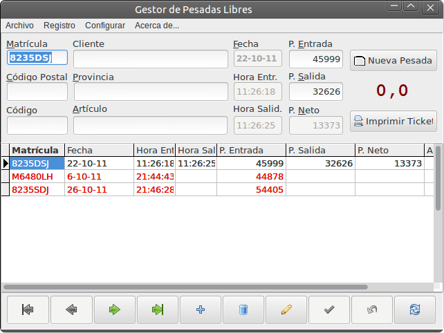

Gestor de Pesadas Libres
========================

Esta aplicación es un proyecto **FreePascal**, realizado con **Lazarus IDE**

Se trata de una aplicación para gestionar el pesaje de una *báscula industrial* con lectura por puerto serie *RS-232* e imprimir un *ticket* en una impresora.

Adicionalmente tiene otras funcionalidades:

- **Gestión de tránsito** para control de carga y descarga.
- **Control de matrículas** de vehículos.
- Internacionalización y localización.
- **Configuración del Puerto serie**
- Élección de impresora.
- Configuración del fichero de datos.

Requisitos
==========

Los requisitos necesarios para poder compilar y usar este proyecto son:

Paquetes y versiones
--------------------

- **FCL 1.0.1**
- **LazUtils 1.0**
- **LCLBase 1.2.6**
- **LCL 1.2.6**
- **cairocanvas_pkg 0.0**
- **LazControls 1.0.1**
- **IDEIntf 1.0**
- **Printer4Lazarus 0.5**
- **DBFLaz 0.1.1**

Deberían estar instaladas por defecto una vez realizada correctamente la instalación de [Lazarus_IDE](http://lazarus.freepascal.org/).

Librerías adicionales
---------------------

- **synapse 4.0**

**[Synapse][1]** proporciona conectividad por puerto serie. También ofrece concectividad TCP/IP, facilidad que no es usada en este proyecto.

[1]: http://www.ararat.cz/synapse/doku.php/download "Synapse"

No necesita instalación, simplemente descargala e incorpora los fuentes necesarios al proyecto.
Si descargas los fuentes desde este repositorio, **Synapse** estará incorporado al proyecto en la implementación de las comunicaciones serie.

Guía de comienzo rápido
=======================

Descarga el proyecto de "Gestor de Pesadas Libres"
--------------------------------------------------

Descarga el proyecto desde GitHub, como un archivo zip o  usando la terminal::

    $ git clone git://github.com/funihao/bascula.git

Esto descargará el repositorio en el directorio actual.

Abre el proyecto
----------------

Desde **Lazarus IDE** ve al menú :file:`> Proyecto > Abrir Proyecto ...` o pulsa *ctrl+F11* y abre el archivo de proyecto :file:`bascula.lpi`

Internacionalización y localización
-----------------------------------

Idiomas
*******

Esta preparado para usar traducción a otros lenguajes.